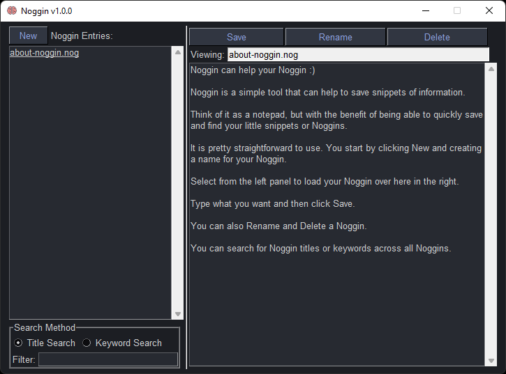

# Noggin can help your Noggin :)

**Version 1.0.0**

---

## Purpose 
Noggin is a personal project that was designed to store and edit useful programming tips in a GUI for easy access.
Intallially the project was going to be the learning project for GIT and pySimpleGUI

---

Noggin is a simple tool that can help to save snippets of information.

Think of it as a notepad, but with the benefit of being able to quickly save and find your little snippets or Noggins.

It is pretty straightforward to use. You start by clicking New and creating a name for your Noggin.

Select from the left panel to load your Noggin over on the right.

Type what you want and then click Save.

You can also Rename and Delete a Noggin.

You can search for Noggin titles or keywords across all Noggins.

---

### Requirements
Python 3.7* or above
PySimpleGUI `pip install PySimpleGUI`

### How to run
python noggin.py

---
## License & copyright
© Vincent J Rossini
